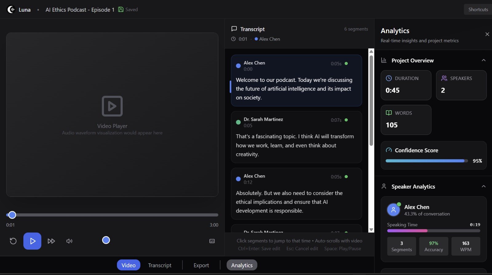
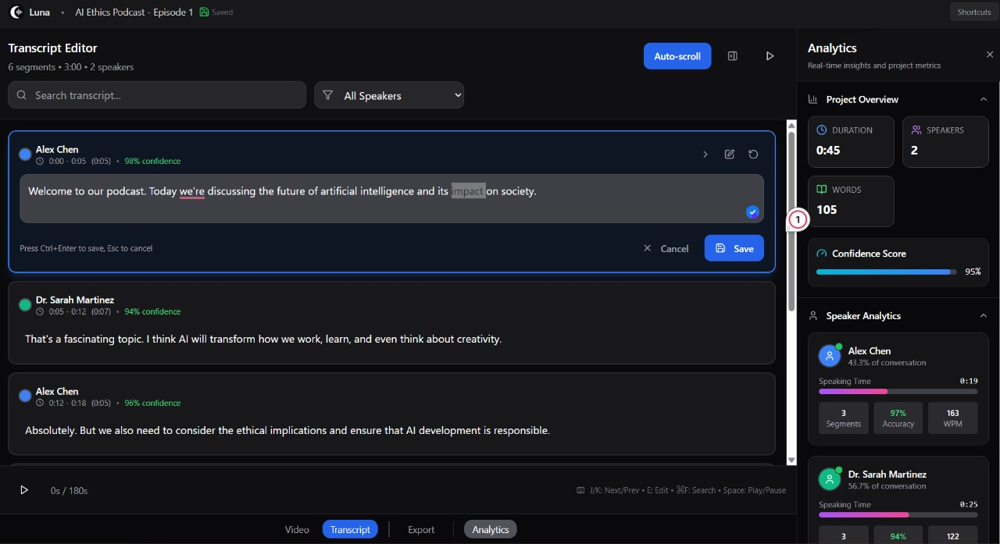

# LUNA — Your Podcast, Perfected (Locally)

> Edge-native podcast creation and editing powered by on-device AI acceleration.


---

## Team members
- Karthick JS    [https://github.com/Karthick-1905/]
- Sundaresan B     [https://github.com/sundaresansrs/]
- Surya Narayanaa N T [https://github.com/SuryaNarayanaa/]
- Yeshwanth S      [https://github.com/yesh-045/]


##  Description

*LUNA* is a standalone Windows application that empowers podcasters, content creators to record, edit, and publish professional-grade audio and video—entirely on-device, with no internet, no latency, and no cloud dependency.

Unlike traditional tools like Descript or Adobe Podcast, LUNA prioritizes data privacy, real-time performance, and offline productivity. By leveraging Snapdragon X Elite's NPU with quantized deep learning models and mixed-precision inference, it delivers a complete, responsive editing pipeline locally.

Whether you're batch-transcribing long sessions or live-editing transcripts, LUNA redefines podcast editing with modular, asynchronous, and hardware-accelerated intelligence—all while keeping your data on your device.

---

##  Table of Contents

- [Features](#features)
- [Tech Stack / Built With](#tech-stack--built-with)
- [Installation](#installation)
- [Usage](#usage)
- [Configuration](#configuration)
- [Sneak peeks](#screenshots--demo)
- [Contributing](#contributing)
- [License](#license)

---

##  Features

- Offline batch or live transcription using Whisper ASR with integrated VAD
- Speaker diarization with automatic speaker labeling and segmentation
- Text-based audio editing—remove filler words, correct speech via transcript
- Multi-speaker voice cloning with real-time TTS (Coqui-TTS)
- Video lip-sync using Wav2Lip for aligned facial articulation
- Modular, parallelized architecture using chunked streaming & shared buffers
- 100% offline operation—no cloud uploads, full local privacy
- Automatic subtitle generation with SRT export and punctuation recovery

---

##  Tech Stack / Built With

- *Python 3*
- *FastAPI* — Service orchestration
- *Whisper / Faster-Whisper* — ASR & VAD transcription
- *CTC Forced Aligner* — Token-level alignment
- *Coqui-TTS* — Text-to-speech (multi-speaker)
- *Wav2Lip* — Lip synchronization
- *ONNX, SNPE, Torch* — Model conversion & acceleration
- *React* — Frontend 
- *FFmpeg, Torchaudio* — Audio preprocessing utilities

---

## ⚙ Installation

> Ensure Python 3.11 and Node.js (for frontend) are installed.

### 1. Clone the repository

```bash
https://github.com/SuryaNarayanaa/LUNA-QUALCOMM-EDGE-AI.git
cd luna
 ```


### 2. Install Python dependencies

```bash
cd backend
pip install -r requirements.txt
```


### 3. Install frontend dependencies
```bash
cd frontend
npm install
```

##  Usage
This section assumes you’ve already installed dependencies.

Run the backend:
```
python main.py
```

Start the frontend :
```
cd frontend
npm run dev
```

## 🔧 Configuration
Create a  file, config.yaml with the following parameters:

 
As per the config.example.yaml


##  Editor





## Demo Video:

[](public/demovid.mp4)


##  Contributing
We welcome community contributions! Please follow the guidelines below:

1. Fork the repository
2. Create a new branch (git checkout -b feature/feature-name)
3. Commit your changes (git commit -m "Add feature")
4. Push to your branch (git push origin feature/feature-name)
5. Open a Pull Request


## 📄 License
This project is licensed under the MIT License.
See the LICENSE file for more information.